# 🧠 Budget Tracker - Ultieme JavaScript Gids

Dit document is de definitieve bron voor het begrijpen van de technische implementatie van de Budget Tracker. Het biedt een diepe duik in de data-architectuur, algoritmen en interactie-logica.

---

## 🏗️ 1. Systeemarchitectuur

De applicatie draait volledig in de browser (**Client-Side**). Er is geen externe database; alle statusbeschrijvingen worden opgeslagen in de `Window.localStorage` API.

### Gegevensmodel (Data Schema)
De app beheert drie primaire datastructuren in de vorm van JSON arrays:

| Array | Object Eigenschappen | Doel |
| :--- | :--- | :--- |
| `transactions` | `date`, `amount`, `type`, `category` | De geschiedenis van voltooide acties. |
| `subscriptions` | `name`, `amount`, `date`, `interval` | Definities voor terugkerende kosten. |
| `oneOffUpcoming` | `name`, `amount`, `date` | Toekomstige kosten die één keer voorkomen. |

---

## 🔄 2. Data Flow Diagram

Hieronder zie je hoe data door het systeem vloeit bij een interactie:

```mermaid
graph TD
    A[Gebruiker voert data in] --> B{Formulier Submit}
    B -->|Bestaand Item| C[Update Array Index]
    B -->|Nieuw Item| D[Array.push]
    C --> E[showData Functie]
    D --> E
    E --> F[Bereken Totalen]
    E --> G[Sorteer Transacties]
    E --> H[Sla op in LocalStorage]
    E --> I[Update DOM / UI]
    J[Gebruiker klikt 'Betaald'] --> K[Voeg toe aan Transactions]
    K --> L[Update Sub Datum / Verwijder One-Off]
    L --> E
```



---

## 🛠️ 3. Gedetailleerde Functie Analyse

### `showData()` - De Centraal Beheerder
Deze functie wordt aangeroepen bij ELKE wijziging. Het is een "idempotente" operatie: het zet de hele lijst opnieuw op basis van de huidige staat van de arrays.

**Logica voor Transacties:**
- **Sorteren**: `transactions.sort((a,b) => new Date(b.date) - new Date(a.date))`. Dit zorgt voor een aflopende chronologische volgorde (O(n log n) complexiteit).
- **Template Literals**: We gebruiken backticks (`` ` ``) om dynamische HTML te genereren. Dit is veiliger en leesbaarder dan string concatenatie.

---

### `showUpcoming()` - Het Projectie Algoritme
Dit is de meest complexe functie in het script. Het moet "raden" wat er in de toekomst gaat gebeuren.

1. **Windowing**: Het definieert een venster van 30 dagen: `nextMonth.setDate(today.getDate() + 30)`.
2. **Subscription Projection Loop**:
   ```javascript
   while (d <= nextMonth) {
       if (d >= today) {
           items.push({ ... });
       }
       // Interval Verhoging
       if (sub.interval === 'monthly') d.setMonth(d.getMonth() + 1);
       else d.setFullYear(d.getFullYear() + 1);
   }
   ```
   Dit algoritme zorgt ervoor dat een maandelijks abonnement dat morgen én over 29 dagen valt, BEIDE getoond worden in de lijst.

3. **Relative Time Calculation**:
   We berekenen het getal door milliseconden om te zetten naar dagen:
   `diff = Math.ceil((item.date - today) / (1000 * 60 * 60 * 24))`

---

### De "Pay" Logica: `paySub` en `payUpcoming`
Wanneer een gebruiker een betaling bevestigt, gebeuren er drie dingen tegelijk:

1. **Archivering**: De data wordt gekopieerd van de "geplande" staat naar de `transactions` array.
2. **State Mutatie**:
   - Bij een **Subscription**: De `date` eigenschap in de array wordt gemuteerd naar de volgende periode (ISO string format `YYYY-MM-DD`).
   - Bij een **One-Off**: Het item wordt volledig verwijderd (`splice`).
3. **UI Sync**: `showData()` wordt aangeroepen om de veranderingen over alle tabbladen heen te tonen.

---

## ⌨️ 4. Formulier & State Management
We maken gebruik van "Hidden Inputs" voor beheer van de bewerkingsmodus.

```javascript
let editInput = document.getElementById('editIndex'); // Waarde is -1 of een index
```

- **Update Pad**: Als `editInput.value !== -1`, dan doen we `transactions[index] = newItem`.
- **Create Pad**: Als de waarde `-1` is, doen we `transactions.push(newItem)`.
- **Reset**: Na elke succesvolle submit doen we `form.reset()` en zetten we de hidden input terug op `-1`.

---

## 📱 5. Tab Systeem (UI Logica)
Het tab-systeem is ontworpen om lichtgewicht te zijn zonder externe bibliotheek.

```javascript
document.querySelectorAll('.tab-btn').forEach(button => {
    button.addEventListener('click', () => {
        // 1. Verwijder 'active' van alle knoppen en alle content secties
        // 2. Voeg 'active' toe aan de huidige knop
        // 3. Gebruik 'data-tab' attribuut om de doelsectie te vinden via ID
    });
});
```
Dit maakt gebruik van CSS classes (`.active { display: flex; }`) om de zichtbaarheid te bepalen, wat sneller is dan direct manipuleren van de `style.display` eigenschap.

---

## 🛠️ 6. Technische Snippets & Best Practices
In de code vind je diverse moderne JS technieken:

- **Arrow Functions**: Voor kortere, anonieme functies (bijv. in `forEach`).
- **Short-circuit Evaluation**: `JSON.parse(...) || []` voor veilige defaults.
- **Destructuring-achtige toegang**: Directe toegang tot object properties binnen loops.
- **Locale Formatting**: `date.toLocaleDateString('nl-NL')` voor een Nederlandse datumweergave.

---

*Dit document dient als handleiding voor toekomstige uitbreidingen van de Transactiestalker codebase.*
